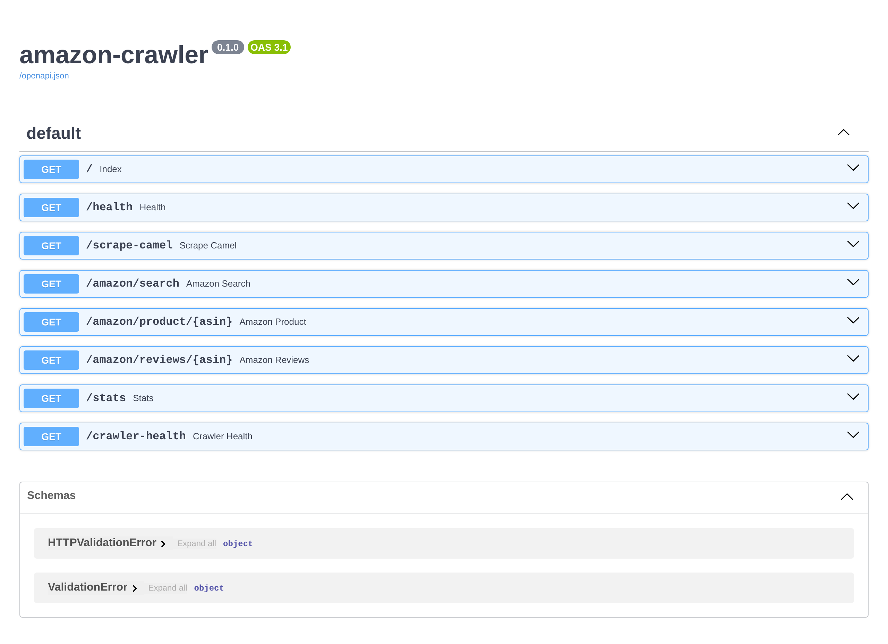
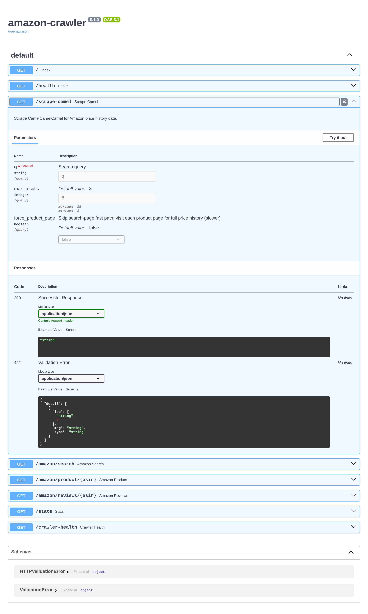

# amazon-crawler

Containerized HTTP service that aggregates Amazon product data — current
prices, price history, eventually reviews and ratings — for downstream
research tools and LLM-grounded product comparisons.

Forked from the CamelCamelCamel scraper that powers
[sell.applesauce.chat](https://sell.applesauce.chat). Designed to be deployed
independently of sell so other apps can talk to it.



## Status

| Endpoint | Status | Notes |
|---|---|---|
| `GET /scrape-camel` | ✅ working | Wraps CCC search + (optional) per-product page visit |
| `GET /amazon/search` | 🚧 501 | Direct amazon.com search |
| `GET /amazon/product/{asin}` | 🚧 501 | Title, price, rating, review count, images |
| `GET /amazon/reviews/{asin}` | 🚧 501 | Paginated review text |
| `GET /health` | ✅ | Liveness probe |
| `GET /stats` | ✅ | Cache hits, request counts, circuit-breaker state |
| `GET /crawler-health` | ✅ | Per-crawler health summary |
| `GET /docs` | ✅ | FastAPI Swagger UI |

See [`ROADMAP.md`](ROADMAP.md) for what's next.

## Quick start (local)

You'll need system Chromium and Xvfb installed:

```bash
sudo apt-get install chromium xvfb
git clone https://github.com/Tsangares/amazon-crawler && cd amazon-crawler
python3 -m venv .venv && .venv/bin/pip install -r requirements.txt
.venv/bin/uvicorn main:app --port 8011
```

```bash
curl 'http://localhost:8011/scrape-camel?q=AeroPress&max_results=5'
```

## Production deploy (systemd)

The service ships with a systemd unit and a `deploy.sh` for the
git-pull-and-restart workflow used across the Applesauce stack.

```bash
# First-time setup on the target host:
git clone https://github.com/Tsangares/amazon-crawler /opt/amazon-crawler
cd /opt/amazon-crawler
python3 -m venv .venv && .venv/bin/pip install -r requirements.txt
cp amazon-crawler.service /etc/systemd/system/
systemctl daemon-reload && systemctl enable --now amazon-crawler

# Subsequent deploys:
ssh root@host /opt/amazon-crawler/deploy.sh
```

The unit listens on port `8011` by default. CDP debug port and Xvfb display
are set to `:9260` / `:99` to avoid clashing with the existing
`ebay-scraper.service` (CCC scraper at `:9250` / `:98`) on the same host.

## Smoke test

```bash
pip install pytest
AMAZON_CRAWLER_URL=http://localhost:8011 pytest tests/test_smoke.py -v
```

## API

### `GET /scrape-camel`

Query CamelCamelCamel for an Amazon product search.



| param | type | default | notes |
|---|---|---|---|
| `q` | string | — | Search query (3+ words ideal) |
| `max_results` | int | 8 | 1–15 |
| `force_product_page` | bool | false | Skip the search-page fast path; visit each product page individually for full price history. Adds ~7s per product. |

**Response shape:**

```json
{
  "query": "AeroPress",
  "count": 5,
  "items": [
    {
      "name": "AeroPress Original Coffee and Espresso Maker",
      "current_price": 39.95,
      "lowest_price": 31.99,
      "highest_price": 49.95,
      "average_price": 38.40,
      "product_url": "https://camelcamelcamel.com/product/B0047BIWSK",
      "strategy_used": "table",
      "third_party_new": null,
      "third_party_used": null
    }
  ],
  "_timing": {"total_ms": 28412, "cache": "miss", "source": "camelcamelcamel"}
}
```

`_timing.cache` values: `miss`, `hit` (in-memory L1), `hit_db` (SQLite L2),
`stale_db` (rate-limited fallback to expired cache).

`strategy_used` per item: `search_page` (fast path), `table` /
`text_regex` / `element_scan` (product-page extraction), or
`search_page_no_price` (no price found anywhere).

By default the service uses the **search-page fast path** — this only
returns `current_price`. If you need price history (`lowest_price`,
`highest_price`, `average_price`) pass `force_product_page=true`. That
path is much slower but every result has full history.

## Architecture

```
                     ┌───────────────────────────┐
   HTTP request ───▶│  FastAPI (main.py)          │
                     │  - /scrape-camel            │
                     │  - /amazon/* (stubs)        │
                     │  - /health, /stats          │
                     └────┬─────────────────┬──────┘
                          │                 │
                ┌─────────▼───────┐   ┌─────▼─────────────┐
                │ scrapers/       │   │ scrapers/         │
                │   camel.py      │   │   amazon.py (TBD) │
                │   - PW thread   │   │                   │
                │   - CDP browser │   │                   │
                │   - Turnstile   │   │                   │
                └────┬────────────┘   └───────────────────┘
                     │
              ┌──────▼─────────────────────────────────┐
              │ Chromium subprocess (system /usr/bin)   │
              │   --remote-debugging-port=9250          │
              │   on Xvfb display :98 (CPU/llvmpipe)    │
              └────────────────────────────────────────┘
              ┌────────────────────────────────────────┐
              │ scrapers/shared.py                      │
              │   L1 in-memory cache + L2 SQLite cache  │
              │   Circuit breakers, hourly rate limit   │
              │   Stats, crawler health tracking        │
              └────────────────────────────────────────┘
```

## Cloudflare bypass

CamelCamelCamel sits behind Cloudflare Turnstile. The bypass that works on
CPU-only servers (no GPU required):

- Run system Chromium **headful** under `Xvfb :98`.
- Connect via CDP from Playwright (`connect_over_cdp`), reuse
  `browser.contexts[0]` so `cf_clearance` cookies persist across requests.
- Chromium flags: `--ignore-gpu-blocklist`, `--enable-features=OverrideSoftwareRenderingList`,
  `--ozone-platform=x11`. WebGL reports as `ANGLE (Mesa, llvmpipe, OpenGL 4.5)`,
  which passes Turnstile fingerprinting.
- Drop `WAYLAND_DISPLAY` from env to force the X11 backend.
- Don't apply `playwright-stealth` on CDP pages — counterproductive.

A 30-second health check thread nulls the browser handle if Chromium or
Xvfb dies, so the next request relaunches cleanly.

## Configuration

| env var | default | notes |
|---|---|---|
| `DATA_DIR` | `./data` | Where SQLite cache files live |
| `CAMEL_PROFILE_DIR` | `/tmp/camel-chrome-profile` | Chromium user-data-dir for CCC |
| `CAMEL_CDP_PORT` | `9250` | CDP debugging port |
| `CAMEL_XVFB_DISPLAY` | `:98` | Virtual display |
| `CHROMIUM_BIN` | `/usr/bin/chromium` | System Chromium path |

The shipped `amazon-crawler.service` overrides `CAMEL_CDP_PORT=9260`,
`CAMEL_XVFB_DISPLAY=:99`, and `CAMEL_PROFILE_DIR=/tmp/amazon-crawler-profile`
so it can coexist with sell's `ebay-scraper.service` (which uses `:98`/`9250`).

## Lineage

This service is a fork of the CCC scraper from
[`Tsangares/sell-applesauce`](https://github.com/Tsangares/sell-applesauce)
under `sell/scrapers/camel.py`. Improvements over the upstream version:

- Standalone deployable (Docker, doesn't depend on sell.applesauce.chat).
- `force_product_page` flag for callers who want full price history.
- Configurable paths (DATA_DIR, profile dir, CDP port, Xvfb display).
- Slimmed `shared.py` (dropped eBay/Mercari/Google scraper plumbing).
- Stub Amazon-direct endpoints scaffolded for future work.
